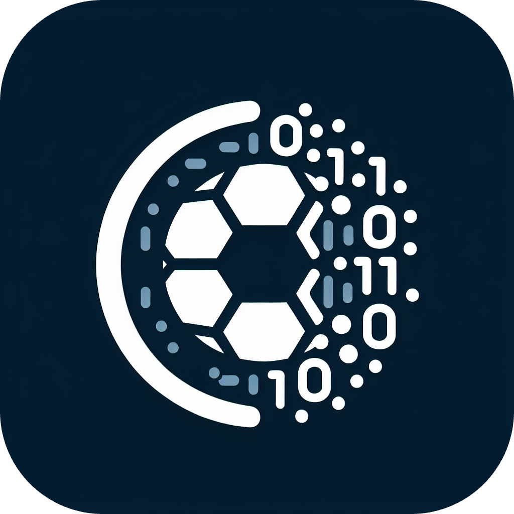
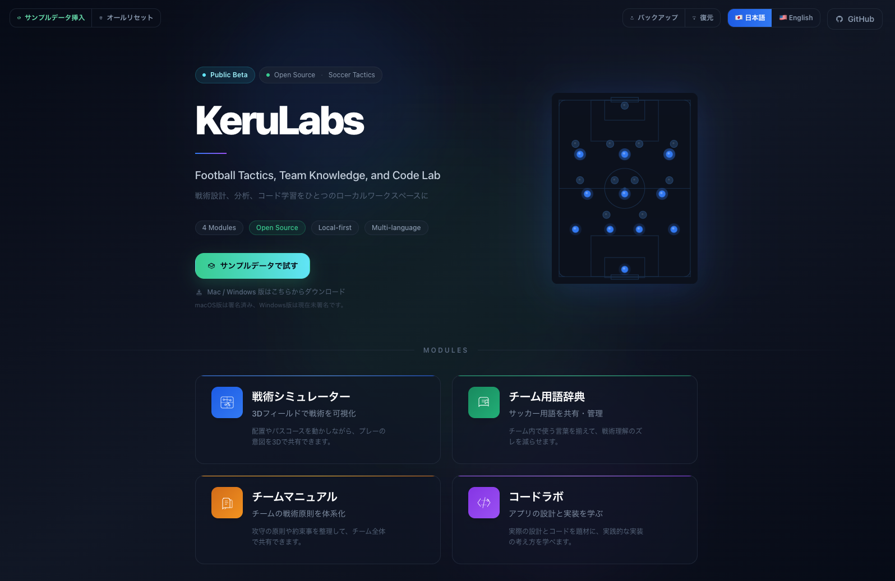
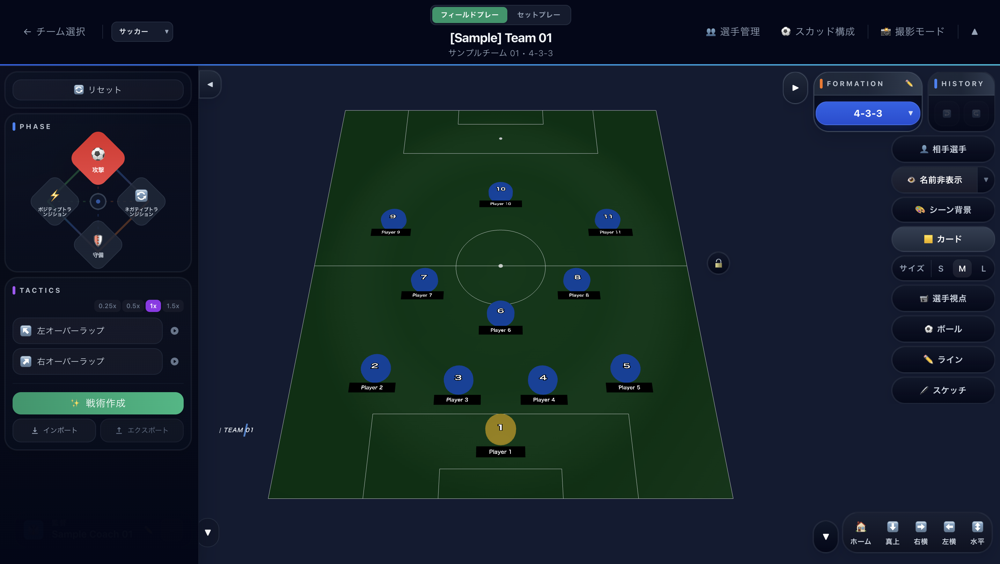
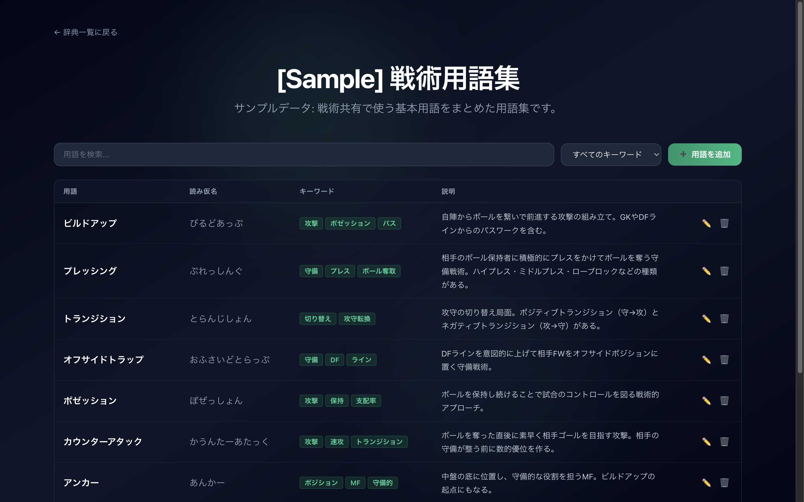
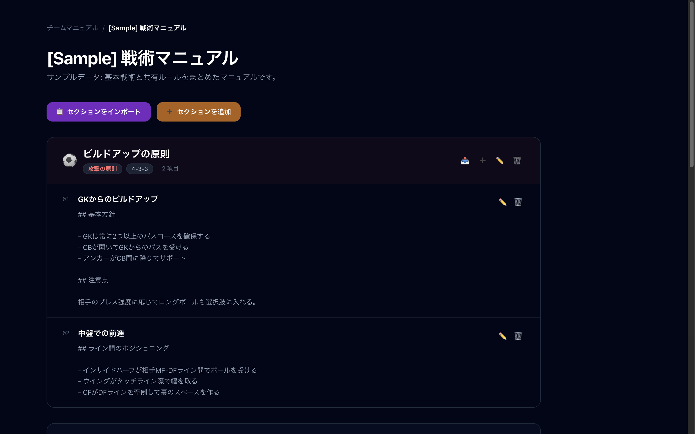
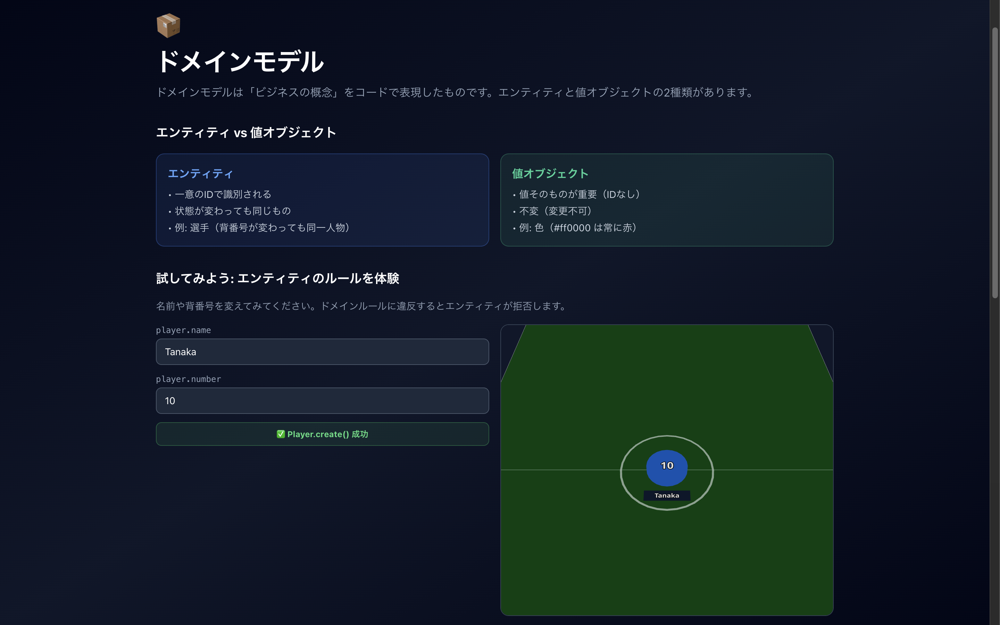

# KeruLabs

[](https://github.com/takataka6/kerulabs/actions/workflows/ci.yml)
[](https://github.com/takataka6/kerulabs/actions/workflows/release.yml)
[](https://github.com/takataka6/kerulabs/releases)
[](LICENSE)



Football Tactics & Code Lab

サッカー戦術を 3D で可視化し、チーム運用に必要な情報をローカルで管理し、実装自体も学べる Web / Electron アプリです。

## 3分でわかる KeruLabs

- **戦術を動かせる**: 3D ピッチ上で選手移動、ボールパス、接続線、タイムラインを使ってプレーを組み立てられます
- **チーム運用をまとめられる**: チーム、選手、用語集、チームマニュアルをひとつのアプリで扱えます
- **学習素材としても使える**: コードラボと ADR により、実装方針とアーキテクチャも追えます
- **ローカル完結で扱える**: データは IndexedDB に保存され、JSON でバックアップ / インポートできます

## 主な機能

| 機能               | できること                                                           |
| ------------------ | -------------------------------------------------------------------- |
| 戦術シミュレーター | 3D フィールドで選手配置、ボール軌道、再生、Undo/Redo、スケッチを操作 |
| チーム管理         | チーム、監督、選手、プロフィール画像、フォーメーションを管理         |
| 用語集             | チーム内の戦術用語を登録、検索、共有                                 |
| チームマニュアル   | テキスト、コード、Mermaid 図を含む戦術マニュアルを作成               |
| コードラボ         | Git、Markdown、Mermaid、テスト、設計などを題材に学習                 |
| プラグイン         | JSON 形式のレッスンプラグインをインポート可能                        |

## 想定ユーザー

- サッカー / フットサルのコーチ、アナリスト、教育担当
- チーム内で戦術や用語を共通化したい人
- React + TypeScript + Clean Architecture の実例を読みたい開発者

## 代表ユースケース

| 使う人              | KeruLabs でできること                                                        |
| ------------------- | ---------------------------------------------------------------------------- |
| 観戦者 / 戦術好き   | 試合を見ながら気づいた配置、パスコース、守備のズレを 3D ピッチ上で手動整理   |
| コーチ / アナリスト | 試合前の配置、パスコース、フェーズごとの狙いを 3D ピッチで整理               |
| チーム運営者        | チーム情報、選手情報、マニュアル、用語集をローカルで一元管理                 |
| 開発者 / 学習者     | React + TypeScript + Clean Architecture の実装例とコードラボを教材として読む |

## 対応モード

| モード   | 人数     |
| -------- | -------- |
| Football | 11 vs 11 |
| Futsal   | 5 vs 5   |
| 8人制    | 8 vs 8   |
| ソサイチ | 7 vs 7   |

## Downloads

最新の配布物は [GitHub Releases](https://github.com/takataka6/kerulabs/releases) から取得できます。

- 配布物の種類、リリースチャネル、運用ポリシーの詳細は [docs/release.md](docs/release.md) を参照してください

| 配布形態   | 対応環境                           | 取得物                        | 補足                                                            |
| ---------- | ---------------------------------- | ----------------------------- | --------------------------------------------------------------- |
| Web 版     | 最新の Chromium / Safari / Firefox | `kerulabs-web-vX.Y.Z.zip`     | ビルド済み静的ファイル。サーバー配信またはローカル preview 用   |
| macOS 版   | Apple Silicon Mac を想定           | `.dmg`, `.zip`                | Electron アプリ。Developer ID 署名済み、Apple notarization 済み |
| Windows 版 | Windows 11 を想定                  | `Setup .exe`, `Portable .exe` | Electron アプリ。現在は未署名の preview build                   |

### インストール時の注意

- **最も手軽なのは Web 版** です。まず試すだけなら `pnpm dev` か配布済み Web bundle の利用を推奨します。
- **Windows 版は未署名** のため、SmartScreen 警告が出る場合があります。通常利用は `KeruLabs Setup X.Y.Z.exe`、インストールせず試す場合は `KeruLabs X.Y.Z.exe` を選んでください。

### macOS の初回起動

`KeruLabs.app` を `Applications` に移動して通常どおり起動できます。

## Screenshots

### Hero Visual



### Product Tour

| View                                                     | Preview                                                                          |
| -------------------------------------------------------- | -------------------------------------------------------------------------------- |
| 戦術シミュレーター: プレーの意図を 3D ピッチ上で共有     |  |
| チーム用語辞典: チーム内の言葉と定義を揃える             |                    |
| チームマニュアル: 原則、図解、共有メモを一箇所にまとめる |              |
| コードラボ: 実装と設計判断を教材として読む               |                    |

### Demo Clip


## Quick Start

### 前提条件

- Node.js 22.x 以上
- pnpm
- Git

### セットアップ

```bash
git clone https://github.com/takataka6/kerulabs.git
cd kerulabs
pnpm install
```

### 起動

```bash
# Web 版
pnpm dev

# Electron 版
pnpm electron:dev

# Storybook
pnpm storybook
```

Web 版は `http://localhost:5173` で起動します。

## ログ確認

### アプリ内ログビューアー

- `Ctrl + Shift + L` でログビューアーを開閉できます
- ログビューアーでは renderer 側ログの一覧表示、レベル / カテゴリ / 検索フィルター、クリア、JSON エクスポートができます

### renderer 側ログの保存先

- アプリケーションログはブラウザの IndexedDB に保存されます
- ログ用 DB 名は `kerulabs_logs` です
- 開発時に直接確認する場合は、ブラウザ DevTools の Application / Storage から参照できます

### Electron main 側ログ

- Electron main process のログはコンソール出力に加えて `userData/kerulabs-main.log.json` に保存されます
- `userData` は Electron のアプリデータディレクトリです
- `pnpm electron:dev` で起動した場合は、起動元ターミナルでも main process のログを確認できます

## よく使うコマンド

| コマンド              | 説明                             |
| --------------------- | -------------------------------- |
| `pnpm dev`            | Vite 開発サーバー起動            |
| `pnpm electron:dev`   | Electron + Vite 同時起動         |
| `pnpm build`          | TypeScript チェック + Web ビルド |
| `pnpm build:electron` | Electron アプリをビルド          |
| `pnpm type-check`     | 型チェック                       |
| `pnpm lint`           | ESLint 実行                      |
| `pnpm format:check`   | Prettier チェック                |
| `pnpm test`           | Vitest 実行                      |
| `pnpm test:coverage`  | カバレッジ付きテスト実行         |
| `pnpm test:e2e`       | Playwright E2E 実行              |
| `pnpm test:a11y`      | Storybook a11y テスト実行        |

## 品質シグナル

- TypeScript strict mode
- ESLint + Prettier + Husky + lint-staged
- Vitest によるユニット / 統合テスト
- Playwright による E2E テスト
- Storybook + axe-playwright によるアクセシビリティ検証
- `madge` による循環依存チェック
- `license-checker` による依存ライセンスチェック
- GitHub Actions で CI、SBOM、Semgrep を実行
- Dependabot による npm/pnpm 依存および GitHub Actions の週次自動更新（関連パッケージをグループ化して PR 数を抑制）

## Coverage

- カバレッジ閾値は Statements / Branches / Functions / Lines すべて **80%** です
- `CI` workflow では `coverage-report` artifact と job summary に coverage 実績を出力します

## 技術スタック

| カテゴリ       | 技術                                                         |
| -------------- | ------------------------------------------------------------ |
| UI             | React 18, TypeScript 5, Tailwind CSS 3                       |
| 3D             | Three.js, React Three Fiber, drei                            |
| デスクトップ   | Electron 35                                                  |
| ビルド         | Vite 6                                                       |
| 状態管理       | TanStack Query v5                                            |
| 永続化         | IndexedDB (`idb`)                                            |
| バリデーション | Zod                                                          |
| セキュリティ   | DOMPurify, CSP, Security Headers, Electron context isolation |
| テスト         | Vitest, Testing Library, Playwright, Storybook               |

## プロジェクト構成

```text
src/
├── domain/          # ビジネスルール
├── application/     # ユースケース、サービス、ポート
├── infrastructure/  # IndexedDB、ファイル、設定、ログ
├── presentation/    # ページ、コンポーネント、フック、コンテキスト
└── shared/          # 定数、i18n、エラー、ユーティリティ
```

依存方向:

```text
Presentation -> Application -> Domain <- Infrastructure
```

詳しい判断理由は [docs/adr/](docs/adr/) を参照してください。

## ドキュメント

| ドキュメント                                       | 説明                          |
| -------------------------------------------------- | ----------------------------- |
| [docs/adr/](docs/adr/)                             | Architecture Decision Records |
| [docs/design-patterns.md](docs/design-patterns.md) | デザインパターンの整理        |
| [docs/issue-triage.md](docs/issue-triage.md)       | Issue とラベル運用            |
| [docs/release.md](docs/release.md)                 | リリース運用                  |
| [docs/use-cases.md](docs/use-cases.md)             | ユースケース一覧              |
| [PLUGIN.md](PLUGIN.md)                             | レッスンプラグイン仕様        |
| [CONTRIBUTING.md](CONTRIBUTING.md)                 | コントリビューションガイド    |
| [CODE_OF_CONDUCT.md](CODE_OF_CONDUCT.md)           | 行動規範                      |
| [SECURITY.md](SECURITY.md)                         | セキュリティポリシー          |
| [CHANGELOG.md](CHANGELOG.md)                       | 変更履歴                      |

## セキュリティ

- Electron では `nodeIntegration: false` と `contextIsolation: true` を採用
- Vite dev / preview と Electron のレンダラーには CSP を適用
- Vite preview / Electron では基本的な Security Headers を付与
- ユーザー入力は DOMPurify でサニタイズ
- インポートデータと永続化データは Zod で検証
- データは主に IndexedDB に保存され、サーバー送信を前提にしていません

詳細は [SECURITY.md](SECURITY.md) を参照してください。

## コントリビュート

Issue / Pull Request を歓迎します。開発フロー、コミット規約、PR チェックリストは [CONTRIBUTING.md](CONTRIBUTING.md) にまとめています。

## ライセンス

[MIT](LICENSE)
