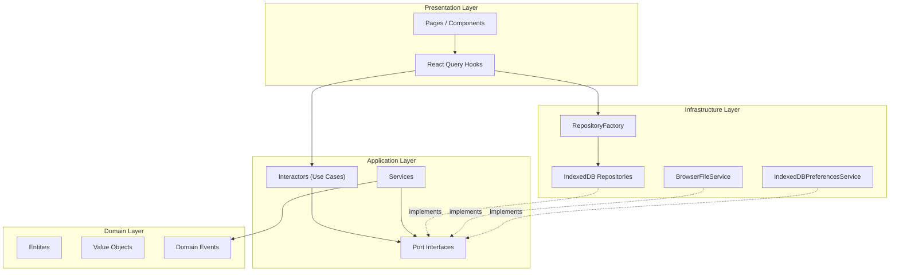
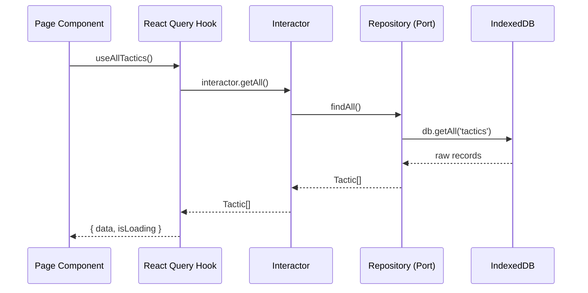
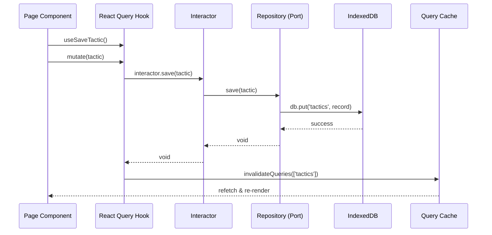

# ユースケース一覧

## アーキテクチャ概要

本アプリケーションは **Clean Architecture** に基づき、以下の4レイヤーで構成されています。



## Interactor（ユースケース）一覧

### 集約別分類

```mermaid
graph LR
    subgraph Tactic["Tactic（戦術）"]
        T1[TacticInteractor]
    end

    subgraph Formation["Formation（フォーメーション）"]
        F1[FormationInteractor]
    end

    subgraph Team["Team（チーム）"]
        TM1[TeamInteractor]
    end

    subgraph Glossary["Glossary（用語集）"]
        G1[GlossaryInteractor]
    end

    subgraph TeamManual["TeamManual（チームマニュアル）"]
        MA1[TeamManualInteractor]
    end

    subgraph Plugin["Plugin（プラグイン）"]
        P1[PluginInteractor]
    end

    style Tactic fill:#1e3a5f,stroke:#3b82f6
    style Formation fill:#1e3a3a,stroke:#10b981
    style Team fill:#3a1e3a,stroke:#a855f7
    style Glossary fill:#3a3a1e,stroke:#eab308
    style TeamManual fill:#1e3a2a,stroke:#22c55e
    style Plugin fill:#3a1e2a,stroke:#ec4899
```



### 一覧表

| # | Interactor | 集約 | メソッド | 使用フック |
|---|-----------|------|---------|-----------|
| 1 | `TacticInteractor` | Tactic | `getAll`, `getByPhase`, `save`, `delete` | `useAllTactics`, `useTactics`, `useSaveTactic`, `useDeleteTactic` |
| 2 | `FormationInteractor` | Formation | `getAll` | `useFormations` |
| 3 | `TeamInteractor` | Team | `getAll`, `getById`, `save`, `delete` | `useTeams` |
| 4 | `GlossaryInteractor` | Glossary | `getAll`, `getById`, `save`, `delete` | `useGlossaries`, `useSaveGlossary`, `useDeleteGlossary` |
| 5 | `TeamManualInteractor` | TeamManual | `getAll`, `getById`, `save`, `delete` | `useTeamManuals`, `useSaveTeamManual`, `useDeleteTeamManual` |
| 6 | `PluginInteractor` | Plugin | `getAll`, `getById`, `importFromJson`, `delete` | `usePlugins`, `usePluginLessons`, `useImportPlugin`, `useDeletePlugin` |

---

## データフロー

### 読取系（Query）



### 書込系（Mutation）



---

## Interactor 詳細

### Tactic（戦術）

#### TacticInteractor

戦術の CRUD 操作を提供する。

```
src/application/use-cases/tactic/TacticInteractor.ts
```

| メソッド | 入力 | 出力 | フック |
|---------|------|------|--------|
| `getAll()` | なし | `Promise<Tactic[]>` | `useAllTactics()` |
| `getByPhase(phase)` | `Phase` | `Promise<Tactic[]>` | `useTactics(phaseValue)` |
| `save(tactic)` | `Tactic` | `Promise<void>` | `useSaveTactic()` |
| `delete(id)` | `string` | `Promise<void>` | `useDeleteTactic()` |

### Formation（フォーメーション）

#### FormationInteractor

フォーメーションの取得操作を提供する。

```
src/application/use-cases/formation/FormationInteractor.ts
```

| メソッド | 入力 | 出力 | フック |
|---------|------|------|--------|
| `getAll()` | なし | `Promise<Formation[]>` | `useFormations()` |

### Team（チーム）

#### TeamInteractor

チームの CRUD 操作を提供する。

```
src/application/use-cases/team/TeamInteractor.ts
```

| メソッド | 入力 | 出力 | フック |
|---------|------|------|--------|
| `getAll()` | なし | `Promise<Team[]>` | `useTeams()` |
| `getById(id)` | `TeamId` | `Promise<Team \| null>` | — |
| `save(team)` | `Team` | `Promise<void>` | `useTeams` (mutation) |
| `delete(id)` | `TeamId` | `Promise<void>` | `useTeams` (mutation) |

### Glossary（用語集）

#### GlossaryInteractor

用語集の CRUD 操作を提供する。

```
src/application/use-cases/glossary/GlossaryInteractor.ts
```

| メソッド | 入力 | 出力 | フック |
|---------|------|------|--------|
| `getAll()` | なし | `Promise<Glossary[]>` | `useGlossaries()` |
| `getById(id)` | `GlossaryId` | `Promise<Glossary \| null>` | — |
| `save(glossary)` | `Glossary` | `Promise<void>` | `useSaveGlossary()` |
| `delete(id)` | `GlossaryId` | `Promise<void>` | `useDeleteGlossary()` |

### TeamManual（チームマニュアル）

#### TeamManualInteractor

チームマニュアルの CRUD 操作を提供する。

```
src/application/use-cases/team-manual/TeamManualInteractor.ts
```

| メソッド | 入力 | 出力 | フック |
|---------|------|------|--------|
| `getAll()` | なし | `Promise<TeamManual[]>` | `useTeamManuals()` |
| `getById(id)` | `TeamManualId` | `Promise<TeamManual \| null>` | — |
| `save(manual)` | `TeamManual` | `Promise<void>` | `useSaveTeamManual()` |
| `delete(id)` | `TeamManualId` | `Promise<void>` | `useDeleteTeamManual()` |

### Plugin（プラグイン）

#### PluginInteractor

プラグインのインポート・管理操作を提供する。JSON バリデーション（Zod）と重複チェックも担当する。

```
src/application/use-cases/plugin/PluginInteractor.ts
```

| メソッド | 入力 | 出力 | フック |
|---------|------|------|--------|
| `getAll()` | なし | `Promise<Plugin[]>` | `usePlugins()` |
| `getById(id)` | `PluginId` | `Promise<Plugin \| null>` | — |
| `importFromJson(json)` | `string` | `Promise<Plugin>` | `useImportPlugin()` |
| `delete(id)` | `PluginId` | `Promise<void>` | `useDeletePlugin()` |

---

## ポートインターフェース（Repository）

各 Interactor はポートインターフェースに依存し、実装の詳細から分離されています。

### ITacticRepository

```typescript
interface ITacticRepository {
  findAll(): Promise<Tactic[]>
  findById(id: string): Promise<Tactic | null>
  findByPhase(phase: Phase): Promise<Tactic[]>
  findByPhaseAndFormation(phase: Phase, formation: string): Promise<Tactic[]>
  save(tactic: Tactic): Promise<void>
  delete(id: string): Promise<void>
}
```

### IFormationRepository

```typescript
interface IFormationRepository {
  findAll(): Promise<Formation[]>
  findById(id: string): Promise<Formation | null>
  findByType(type: string): Promise<Formation[]>
  save(formation: Formation): Promise<void>
  delete(id: string): Promise<void>
}
```

### ITeamRepository

```typescript
interface ITeamRepository {
  findAll(): Promise<Team[]>
  findById(id: TeamId): Promise<Team | null>
  save(team: Team): Promise<void>
  delete(id: TeamId): Promise<void>
}
```

### IGlossaryRepository

```typescript
interface IGlossaryRepository {
  findAll(): Promise<Glossary[]>
  findById(id: GlossaryId): Promise<Glossary | null>
  save(glossary: Glossary): Promise<void>
  delete(id: GlossaryId): Promise<void>
}
```

### ITeamManualRepository

```typescript
interface ITeamManualRepository {
  findAll(): Promise<TeamManual[]>
  findById(id: TeamManualId): Promise<TeamManual | null>
  save(manual: TeamManual): Promise<void>
  delete(id: TeamManualId): Promise<void>
}
```

### IPluginRepository

```typescript
interface IPluginRepository {
  findAll(): Promise<Plugin[]>
  findById(id: PluginId): Promise<Plugin | null>
  findByMetadataId(metadataId: string): Promise<Plugin | null>
  save(plugin: Plugin): Promise<void>
  delete(id: PluginId): Promise<void>
}
```

### IFileService

```typescript
interface IFileService {
  downloadJson(json: string, filename: string): void
  openFilePicker(accept: string): Promise<string>
}
```

### IBackupService

```typescript
interface IBackupService {
  exportAll(): Promise<Record<string, unknown[]>>
  importAll(data: Record<string, unknown[]>): Promise<void>
}
```

### IPreferencesService

```typescript
interface IPreferencesService {
  get<K extends keyof PreferenceMap>(key: K): PreferenceMap[K]
  set<K extends keyof PreferenceMap>(key: K, value: PreferenceMap[K]): void
  remove(key: keyof PreferenceMap): void
}
```

---

## アプリケーションサービス

Interactor とは別に、複合的なロジックを持つサービスが存在します。

| サービス | 責務 | メソッド |
|---------|------|---------|
| `TacticShareService` | 戦術のエクスポート/インポート | `export(tactics)`, `import(json)` |
| `TacticExecutor` | 戦術アニメーションの実行制御 | `execute()`, `cancel()`, `isExecuting()` |
| `AppBackupService` | アプリ全体のバックアップ/リストア | `export()`, `import(json)` |

---

## Presentation Layer との接続

全ての Interactor は **React Query Hooks** を介して Presentation Layer から利用されます。

```mermaid
graph LR
    subgraph Hooks["React Query Hooks"]
        direction TB
        H1["useAllTactics()"]
        H2["useTactics(phase)"]
        H3["useSaveTactic()"]
        H4["useDeleteTactic()"]
        H5["useFormations()"]
        H6["useTeams()"]
        H7["useGlossaries()"]
        H8["useSaveGlossary()"]
        H9["useDeleteGlossary()"]
        H10["useTeamManuals()"]
        H11["useSaveTeamManual()"]
        H12["useDeleteTeamManual()"]
        H13["usePlugins()"]
        H14["useImportPlugin()"]
        H15["useDeletePlugin()"]
    end

    subgraph Interactors["Interactors"]
        direction TB
        U1["TacticInteractor"]
        U2["FormationInteractor"]
        U3["TeamInteractor"]
        U4["GlossaryInteractor"]
        U5["TeamManualInteractor"]
        U6["PluginInteractor"]
    end

    H1 --> U1
    H2 --> U1
    H3 --> U1
    H4 --> U1
    H5 --> U2
    H6 --> U3
    H7 --> U4
    H8 --> U4
    H9 --> U4
    H10 --> U5
    H11 --> U5
    H12 --> U5
    H13 --> U6
    H14 --> U6
    H15 --> U6

    style Hooks fill:#1e293b,stroke:#3b82f6
    style Interactors fill:#1e293b,stroke:#10b981
```



### Hook の種類

| 種別 | Hook | React Query | 用途 |
|------|------|-------------|------|
| Query | `useAllTactics` | `useQuery` | 全戦術取得 |
| Query | `useTactics` | `useQuery` | フェーズ別戦術取得 |
| Mutation | `useSaveTactic` | `useMutation` | 戦術保存 |
| Mutation | `useDeleteTactic` | `useMutation` | 戦術削除 |
| Query | `useFormations` | `useQuery` | 全フォーメーション取得 |
| Query | `useTeams` | `useQuery` | 全チーム取得 |
| Query | `useGlossaries` | `useQuery` | 全用語集取得 |
| Mutation | `useSaveGlossary` | `useMutation` | 用語集保存 |
| Mutation | `useDeleteGlossary` | `useMutation` | 用語集削除 |
| Query | `useTeamManuals` | `useQuery` | 全チームマニュアル取得 |
| Mutation | `useSaveTeamManual` | `useMutation` | チームマニュアル保存 |
| Mutation | `useDeleteTeamManual` | `useMutation` | チームマニュアル削除 |
| Query | `usePlugins` | `useQuery` | 全プラグイン取得 |
| Query | `usePluginLessons` | `useQuery` | レッスンプラグイン取得 |
| Mutation | `useImportPlugin` | `useMutation` | プラグインインポート |
| Mutation | `useDeletePlugin` | `useMutation` | プラグイン削除 |

---

## ディレクトリ構成

```
src/application/
├── use-cases/
│   ├── tactic/
│   │   └── TacticInteractor.ts
│   ├── formation/
│   │   └── FormationInteractor.ts
│   ├── team/
│   │   └── TeamInteractor.ts
│   ├── glossary/
│   │   └── GlossaryInteractor.ts
│   ├── team-manual/
│   │   └── TeamManualInteractor.ts
│   └── plugin/
│       └── PluginInteractor.ts
├── ports/
│   ├── input/
│   │   ├── ITacticInputPort.ts
│   │   ├── ITeamInputPort.ts
│   │   ├── IFormationInputPort.ts
│   │   ├── IGlossaryInputPort.ts
│   │   ├── ITeamManualInputPort.ts
│   │   └── IPluginInputPort.ts
│   └── output/
│       ├── repositories/
│       │   ├── ITacticRepository.ts
│       │   ├── IFormationRepository.ts
│       │   ├── ITeamRepository.ts
│       │   ├── IGlossaryRepository.ts
│       │   ├── ITeamManualRepository.ts
│       │   └── IPluginRepository.ts
│       └── services/
│           ├── IFileService.ts
│           ├── IBackupService.ts
│           └── IPreferencesService.ts
├── schemas/
│   ├── tacticExportSchema.ts
│   ├── teamImportSchema.ts
│   ├── glossaryImportSchema.ts
│   ├── teamManualImportSchema.ts
│   └── appBackupSchema.ts
├── services/
│   ├── TacticShareService.ts
│   ├── TacticExecutor.ts
│   └── AppBackupService.ts
├── utils/
│   └── withErrorHandling.ts
└── ServiceContainer.ts
```

---

## テストカバレッジ

### 単体テスト（Vitest）

| レイヤー | テストファイル数 | 内訳 |
|---------|--------------|------|
| Domain | 20 | エンティティ（9）、値オブジェクト（7）、イベント（2）、型（2） |
| Application | 14 | Interactor（6）、サービス（3）、スキーマ（2）、ユーティリティ（1）、DI コンテナ（1）、App（1） |
| Infrastructure | 17 | リポジトリ（8）、スキーマ（4）、ファクトリ（1）、ログ（2）、サービス（2） |
| Presentation | 118 | コンポーネント（60）、フック（38）、ページ（6）、コンテキスト（3）、ユーティリティ（1）、クエリ（2）、その他（8） |
| Shared | 8 | 定数（5）、ログ（1）、エラー（2） |
| **合計** | **177** | — |

### E2Eテスト（Playwright）

| テストファイル | テスト数 | 対象ページ |
|--------------|---------|-----------|
| home.spec.ts | 6 | ホームページ |
| glossary.spec.ts | 14 | 用語集ページ |
| code-lab.spec.ts | 8 | コードラボページ |
| tactics-simulator.spec.ts | 14 | 戦術シミュレーターページ |
| navigation.spec.ts | 3 | ページ間ナビゲーション |
| player-management.spec.ts | 8 | 選手管理 |
| team-crud.spec.ts | 7 | チーム CRUD |
| team-manual.spec.ts | 16 | チームマニュアルページ |
| seed-sample.spec.ts | 1 | サンプルデータ投入 |
| **合計** | **77** | — |
